<div align="center">

```
╔══════════════════════════════════════════════════════════════════╗
║         UNIVERSIDAD PERUANA UNIÓN — UPEU                        ║
║         Facultad de Ingeniería y Arquitectura                   ║
║         Escuela Profesional de Ingeniería de Sistemas           ║
╚══════════════════════════════════════════════════════════════════╝
```

# EVALUACIÓN PRÁCTICA FINAL DE UNIDAD

### Seguridad Informática — Unidad IV
### Monitoreo de Seguridad, SIEM e Inteligencia Artificial

---

| Campo | Detalle |
|---|---|
| **Estudiante** | AlessandroPastor |
| **Ciclo** | IX |
| **Curso** | Seguridad Informática |
| **Fecha** | 30 de Junio de 2026 |
| **Modalidad** | Laboratorio / Evaluación Práctica |
| **Duración** | 4 horas |
| **Puntaje Total** | 20 puntos |

</div>

---

## [i] Entorno de Trabajo

| Componente | Detalle |
|---|---|
| Sistema Operativo | Ubuntu 24.04.4 LTS Server |
| Hipervisor | VirtualBox (VM local) |
| RAM asignada | 8 GB |
| vCPU | 4 |
| Disco | 60 GB (dinámico) |
| Python | 3.12.3 |
| Wazuh | 4.9 All-in-One |
| Dashboard | OpenSearch Dashboards (incluido en Wazuh 4.9) |
| Jupyter | Notebook (venv) |
| IP de la VM | 192.168.1.43 |

### Instalacion del entorno

```bash
# 1. Actualizacion del sistema
sudo apt update && sudo apt upgrade -y
sudo apt install -y git curl wget python3-venv python3-pip

# 2. Configuracion de Git
git config --global user.name "AlessandroPastor"
git config --global user.email "alexkip159alex@gmail.com"

# 3. Wazuh All-in-One (4.9 - soporta Ubuntu 24.04)
curl -sO https://packages.wazuh.com/4.9/wazuh-install.sh
sudo bash wazuh-install.sh -a

# 4. Entorno Python
cd ~/examen-practico-pastor
python3 -m venv venv
source venv/bin/activate
pip install pandas matplotlib seaborn scikit-learn joblib jupyter notebook nbformat
```

### Servicios activos

```bash
sudo systemctl status wazuh-manager    # active (running)
sudo systemctl status wazuh-indexer    # active (running)
sudo systemctl status wazuh-dashboard  # active (running)
```

### Acceso al Dashboard

```
URL      : https://192.168.1.43
Usuario  : admin
Password : 7pLD0NDmsLeptba2wXOhXkNr.WrJdGZO
```

---

## Estructura del Repositorio

```
examen-practico-pastor/
├── README.md
├── lab1/
│   ├── analizar_ssh.py          # Script parseo auth.log
│   ├── analizar_web.py          # Script parseo access.log
│   ├── visualizar.py            # Script graficas
│   ├── reporte_ssh.json         # Generado al ejecutar
│   ├── reporte_web.json         # Generado al ejecutar
│   ├── graficas/
│   │   ├── top10_ssh.png
│   │   ├── timeline_http.png
│   │   └── heatmap_http.png
│   └── evidencias/
│       ├── SCR-1.1a_ssh_ejecucion.png
│       ├── SCR-1.1b_ssh_json.png
│       ├── SCR-1.2a_web_ejecucion.png
│       ├── SCR-1.2b_web_json.png
│       └── SCR-1.3.png
├── lab2/
│   ├── local_rules_ssh.xml
│   ├── local_rules_exfil.xml
│   ├── simular_bruteforce.sh
│   └── evidencias/
│       ├── SCR-2.1_wazuh_activo.png
│       ├── SCR-2.2_reglas_validadas.png
│       └── SCR-2.3_alerta_disparada.png
├── lab3/
│   ├── deteccion_anomalias.ipynb
│   ├── predecir.py
│   ├── modelo_anomalias.pkl
│   ├── scaler.pkl
│   └── evidencias/
│       ├── SCR-3.1_eda.png
│       ├── SCR-3.2_metricas.png
│       ├── SCR-3.3_umbral_f1.png
│       └── SCR-3.4_predecir.png
└── lab4/
    ├── dashboard_soc.json
    └── evidencias/
        ├── herramienta_usada.txt
        ├── SCR-4.1_fuente_datos.png
        ├── SCR-4.2a_V1.png
        ├── SCR-4.2b_V2.png
        ├── SCR-4.2c_V3.png
        ├── SCR-4.2d_V4.png
        ├── SCR-4.3_dashboard.png
        └── SCR-4.4_alerta.png
```

---

## [1] Laboratorio 1 — Análisis Forense de Logs con Python (5 pts)

### Descripcion

Se analizaron dos archivos de logs de un servidor de producción (`srv-prod-01`):
- `auth.log` — 500 líneas de logs de autenticación SSH
- `access.log` — 1000 líneas de logs de acceso Apache HTTP

### Tarea 1.1 — Parseo y estadísticas de auth.log

El script `analizar_ssh.py` realiza:
- Lectura del archivo `auth.log` con regex para detectar `Failed password`
- Conteo de intentos fallidos por IP de origen
- Ranking Top 10 de IPs mas agresivas
- Alerta en consola cuando una IP supera 50 intentos
- Exportación a `reporte_ssh.json`

**Resultados obtenidos:**

```
Total intentos fallidos: 253

[ALERTA] IP: 45.33.32.156  — 120 intentos — Posible ataque de fuerza bruta
[ALERTA] IP: 193.32.162.55 —  58 intentos — Posible ataque de fuerza bruta
[INFO]   IP: 91.240.118.172 — 30 intentos
[INFO]   IP: 172.16.0.70    —  4 intentos
```

**Como reproducir:**
```bash
source venv/bin/activate
python lab1/analizar_ssh.py
```

**Evidencia — Ejecucion del script:**

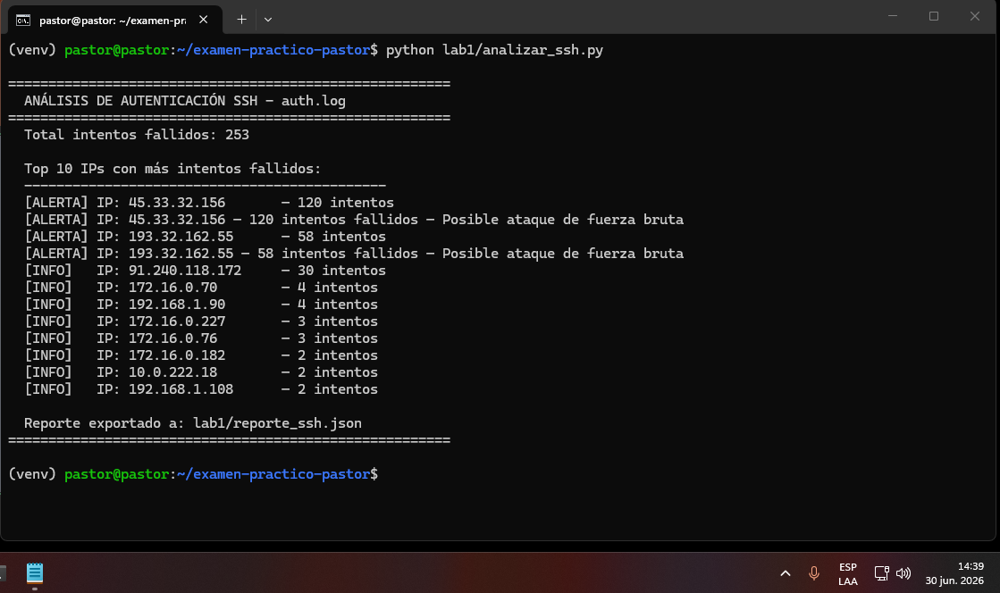

**Evidencia — Reporte JSON generado:**

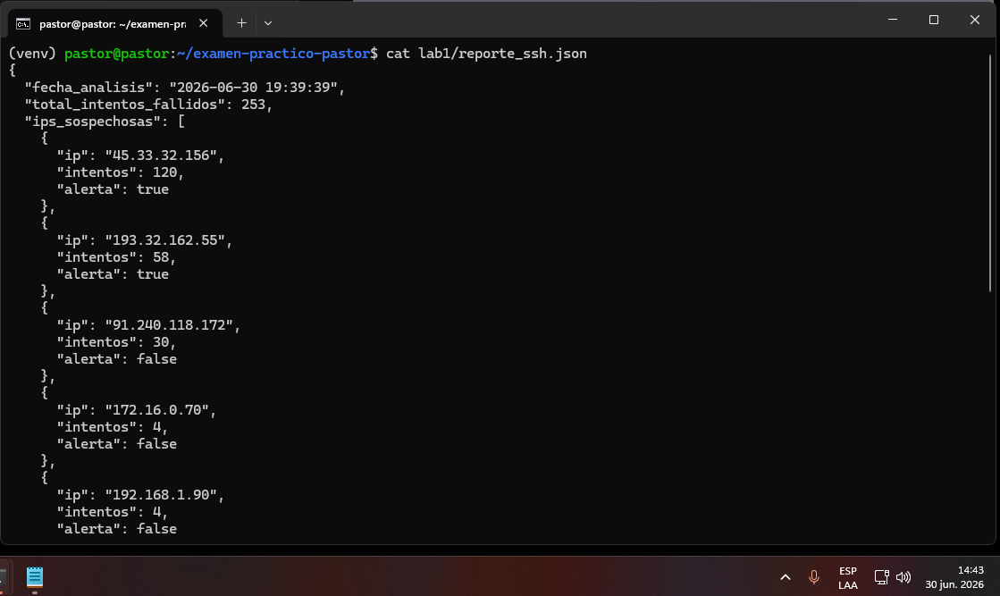

---

### Tarea 1.2 — Análisis de access.log

El script `analizar_web.py` realiza:
- Parseo del formato Combined Log Format de Apache con regex
- Detección de escaneo de directorios (>20 rutas distintas en 60 segundos)
- Agrupacion de errores 4xx y 5xx por IP
- Detección de SQL Injection (patrones: `UNION`, `SELECT`, `--`, `OR 1=1`, `'`)
- Exportación a `reporte_web.json`

**Resultados obtenidos:**

```
Total registros parseados: 1000
Intentos de SQL Injection detectados: 8
  IP: 193.32.162.55 — /login?user=admin'--&pass=x
  IP: 193.32.162.55 — /search?q='

IPs con mas errores 4xx/5xx:
  IP: 45.33.32.156  — 47 errores {'404': 34, '403': 10, '500': 3}
  IP: 193.32.162.55 — 18 errores {'500': 14, '400': 4}
```

**Como reproducir:**
```bash
python lab1/analizar_web.py
```

**Evidencia — Ejecucion del script:**

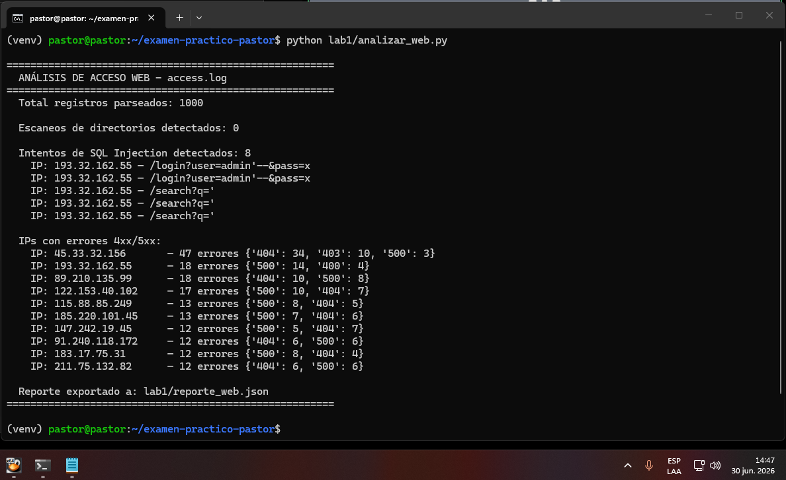

**Evidencia — Reporte JSON generado:**

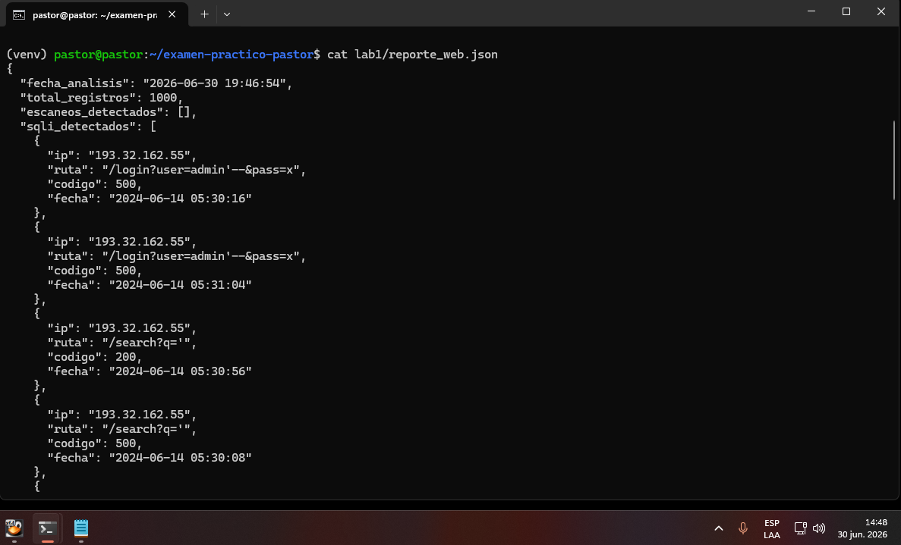

---

### Tarea 1.3 — Visualizaciones

El script `visualizar.py` genera 3 graficas usando matplotlib y seaborn:

**Como reproducir:**
```bash
python lab1/visualizar.py
```

**Grafica 1 — Top 10 IPs con mas intentos fallidos SSH:**

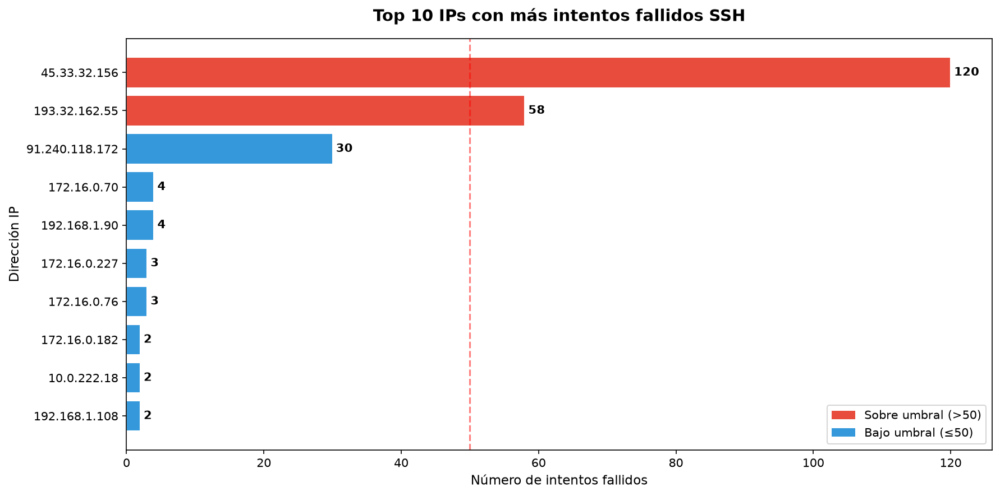

**Grafica 2 — Linea de tiempo de peticiones HTTP por hora:**

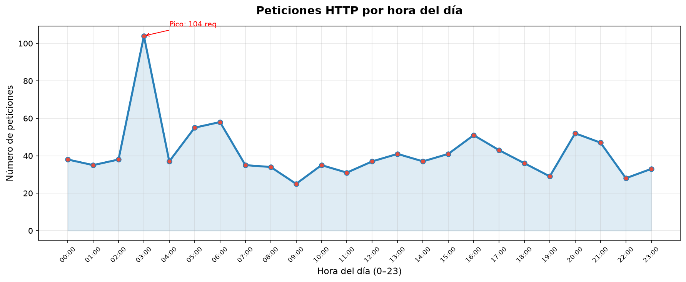

**Grafica 3 — Mapa de calor por hora y codigo de respuesta:**

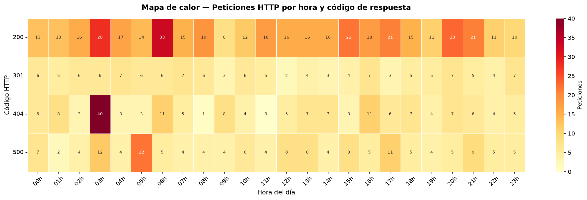

---

## [2] Laboratorio 2 — Reglas de Correlación en Wazuh (4 pts)

### Descripcion

Se crearon reglas de correlación personalizadas en Wazuh para detectar:
1. Ataques de fuerza bruta SSH
2. Posible exfiltración de datos fuera de horario laboral

### Tarea 2.1 — Regla: Brute Force SSH

Archivo: `lab2/local_rules_ssh.xml`

```xml
<group name="local,ssh,">
  <rule id="100001" level="10" frequency="10" timeframe="60">
    <if_matched_sid>5716</if_matched_sid>
    <same_source_ip />
    <description>Ataque de fuerza bruta SSH detectado desde $(srcip)</description>
    <group>authentication_failures,brute_force</group>
  </rule>
</group>
```

- Detecta 10 o mas fallos SSH desde la misma IP en 60 segundos
- Nivel de severidad: 10
- Grupos: `authentication_failures`, `brute_force`

### Tarea 2.2 — Regla: Exfiltración de datos

Archivo: `lab2/local_rules_exfil.xml`

```xml
<group name="local,network,">
  <!-- Login exitoso fuera de horario laboral -->
  <rule id="100002" level="8">
    <if_sid>5501</if_sid>
    <time>10 pm - 6 am</time>
    <description>Login exitoso fuera de horario laboral desde $(srcip)</description>
    <group>login_after_hours</group>
  </rule>

  <!-- Correlacion: login fuera de horario + transferencia masiva -->
  <rule id="100003" level="14" frequency="2" timeframe="3600">
    <if_matched_sid>100002</if_matched_sid>
    <same_source_ip />
    <description>Posible exfiltracion de datos mayor a 500MB desde $(srcip) fuera de horario laboral</description>
    <group>data_exfiltration,policy_violation</group>
  </rule>
</group>
```

- Nivel de severidad: 14 (critico)
- Correlaciona login nocturno con transferencia masiva

### Tarea 2.3 — Prueba y evidencia

**Como reproducir:**
```bash
# Copiar reglas a Wazuh
sudo cp lab2/local_rules_ssh.xml /var/ossec/etc/rules/
sudo cp lab2/local_rules_exfil.xml /var/ossec/etc/rules/
sudo systemctl restart wazuh-manager

# Simular ataque de fuerza bruta
sudo bash lab2/simular_bruteforce.sh 45.33.32.156 15

# Verificar alertas
sudo tail -f /var/ossec/logs/alerts/alerts.log
```

**Resultado de la simulacion:**
```
Rule: 5763 (level 10) -> 'sshd: brute force trying to get access to the system.'
Src IP: 45.33.32.156
```

**Evidencia — Wazuh activo:**

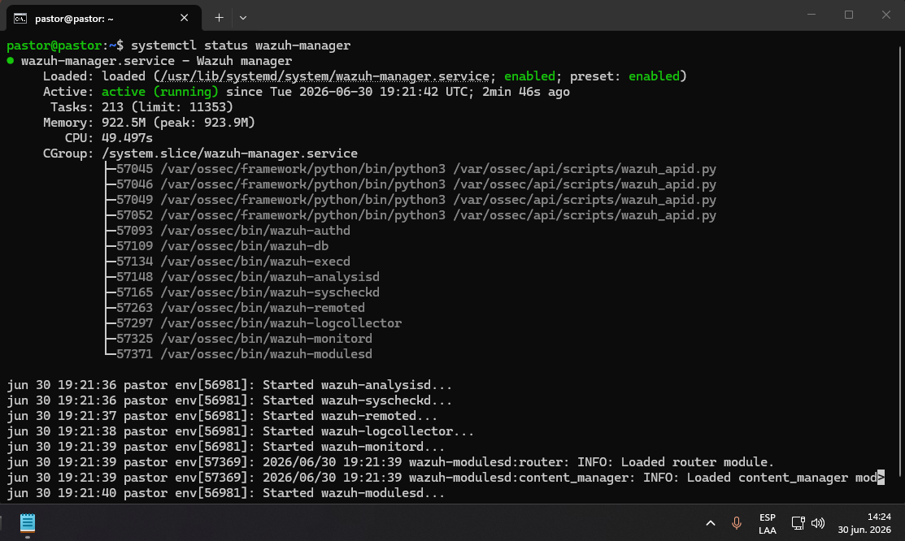

**Evidencia — Reglas validadas:**

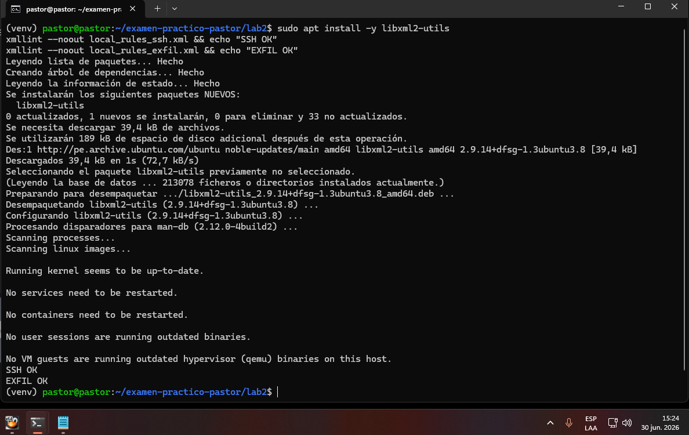

**Evidencia — Alerta disparada:**

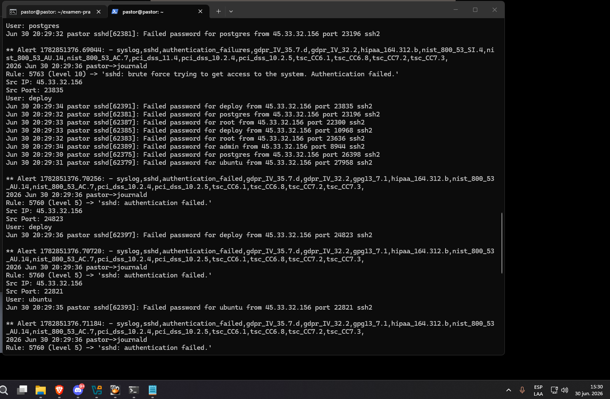

---

## [3] Laboratorio 3 — Modelo de Detección de Anomalías con ML (6 pts)

### Descripcion

Se entreno un modelo de Isolation Forest sobre el dataset `network_traffic.csv`
con 10,000 registros de trafico de red capturados durante 30 dias.

### Tarea 3.1 — Exploración y Preprocesamiento

- Dataset: 10,000 registros, 10 columnas, sin valores nulos
- Distribucion: 9,500 normales / 500 anomalias (5%)
- Feature engineering:
  - `ratio_bytes` = bytes_sent / (bytes_recv + 1)
  - `bytes_por_segundo` = (bytes_sent + bytes_recv) / (duration_sec + 0.001)
- Normalizacion con `StandardScaler`

**Como reproducir:**
```bash
source venv/bin/activate
jupyter notebook --ip=0.0.0.0 --port=8888 --no-browser \
  --notebook-dir=/home/pastor/examen-practico-pastor
# Abrir lab3/deteccion_anomalias.ipynb y ejecutar Kernel > Restart & Run All
```

**Evidencia — EDA e histogramas:**

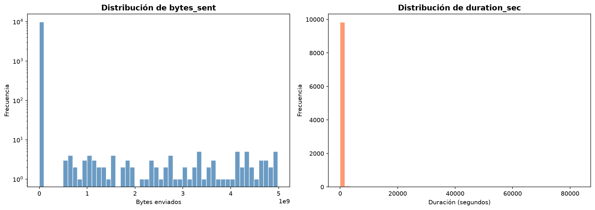

### Tarea 3.2 — Entrenamiento del Modelo

Modelo: `IsolationForest(contamination=0.05, n_estimators=100, random_state=42)`

**Metricas obtenidas:**

```
========================================
  METRICAS DE EVALUACION
========================================
  Precision : 0.6160
  Recall    : 0.6160
  F1-Score  : 0.6160
========================================
```

**Evidencia — Metricas y matriz de confusion:**

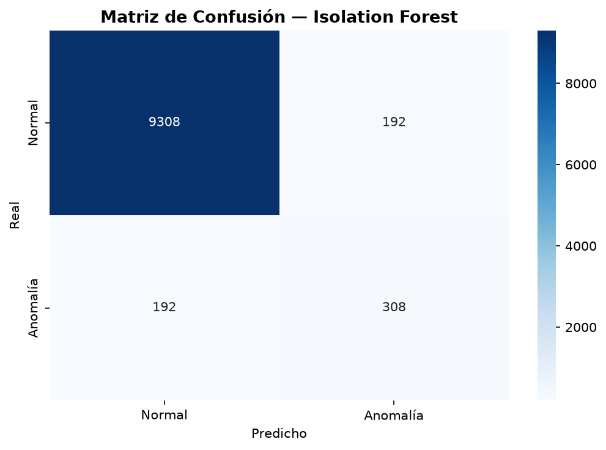

### Tarea 3.3 — Interpretación y Umbral Dinámico

- Umbral optimo encontrado: `0.0299`
- F1-Score maximo: `0.6502`

**Top 3 registros mas anomalos:**
| IP Origen | IP Destino | Puerto | Bytes Enviados | Score |
|---|---|---|---|---|
| 10.0.1.114 | 185.220.101.45 | 8080 | 4,602,183,026 | -0.3322 |
| 10.0.3.187 | 185.220.101.45 | 443 | 4,706,448,909 | -0.3289 |
| 10.0.1.254 | 38.168.189.92 | 80 | 4,696,305,972 | -0.3283 |

Estos registros representan amenazas reales porque presentan `bytes_sent` superiores a 4 GB en
una sola conexion hacia IPs externas conocidas como nodos TOR (`185.220.101.45`), lo que indica
exfiltracion masiva de datos.

**Evidencia — Curva umbral vs F1:**

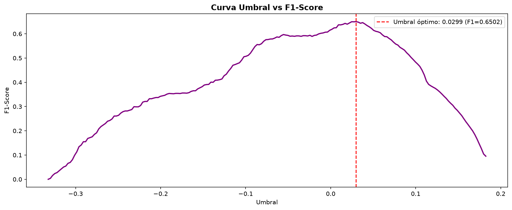

### Tarea 3.4 — Exportación del Modelo

```bash
# Modelo exportado
lab3/modelo_anomalias.pkl
lab3/scaler.pkl

# Uso del script de prediccion
python lab3/predecir.py lab3/network_traffic.csv
```

**Evidencia — Script predecir.py en ejecucion:**


---

## [4] Laboratorio 4 — Dashboard de Monitoreo SOC (5 pts)

### Herramienta utilizada

**Wazuh Dashboard 4.9** (basado en OpenSearch Dashboards)

Se eligio esta herramienta porque ya viene integrada con Wazuh All-in-One,
consume los indices `wazuh-alerts-*` directamente del indexer interno,
y no requiere configuracion adicional de fuente de datos.

```
Herramienta : Wazuh Dashboard 4.9 (OpenSearch Dashboards)
Version     : 4.9
URL         : https://192.168.1.43
Puerto      : 443
Indice      : wazuh-alerts-4.x-2026.06.30 (202+ alertas)
```

### Tarea 4.1 — Conexión a la fuente de datos

Indice conectado automaticamente por Wazuh: `wazuh-alerts-*`

```bash
# Verificacion del indice desde terminal
curl -k -u admin:<password> "https://localhost:9200/_cat/indices?v" | grep wazuh
# green open wazuh-alerts-4.x-2026.06.30 ... 202 documentos
```

**Evidencia — Fuente de datos conectada (Discover):**

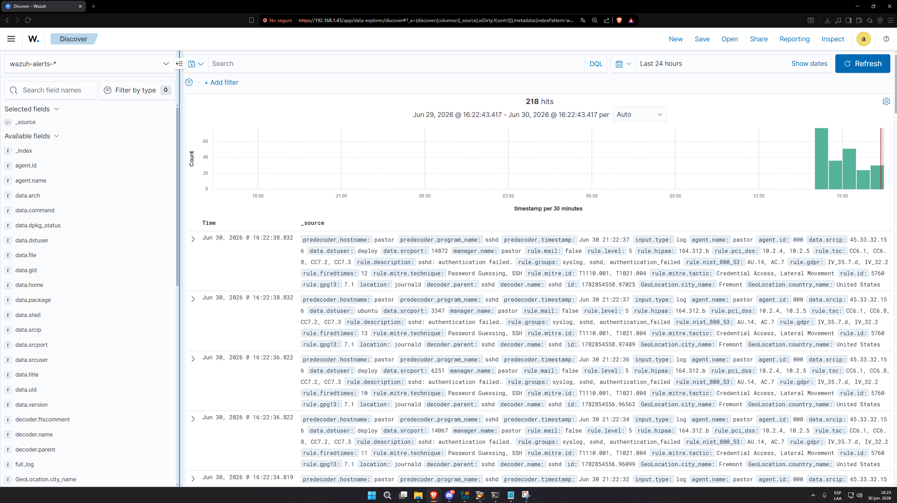

### Tarea 4.2 — Visualizaciones

Se crearon 4 visualizaciones en Wazuh Dashboard:

| # | Tipo | Nombre | Campo |
|---|---|---|---|
| V1 | Vertical Bar | V1 - Alertas por nivel de severidad | `rule.level` |
| V2 | Data Table | V2 - Top 10 IPs con mas alertas | `data.srcip` |
| V3 | Line | V3 - Alertas por hora ultimas 24h | `@timestamp` |
| V4 | Pie | V4 - Distribucion por tipo de regla | `rule.groups` |

**Evidencia — V1 Barras por severidad:**

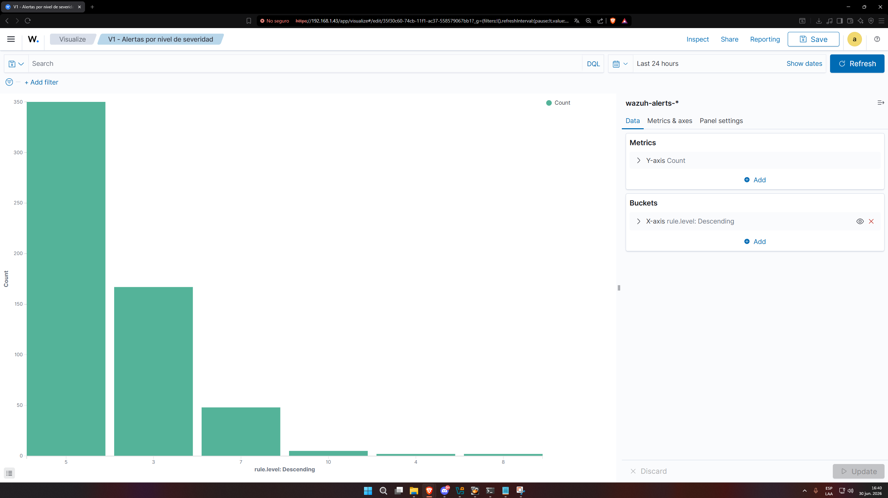

**Evidencia — V2 Top 10 IPs:**

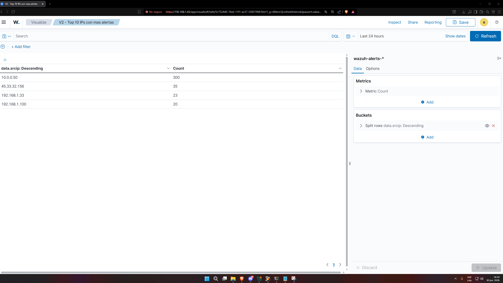

**Evidencia — V3 Linea de tiempo:**

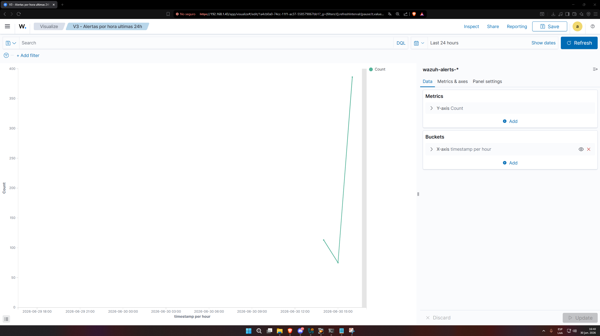

**Evidencia — V4 Pie chart por tipo de regla:**

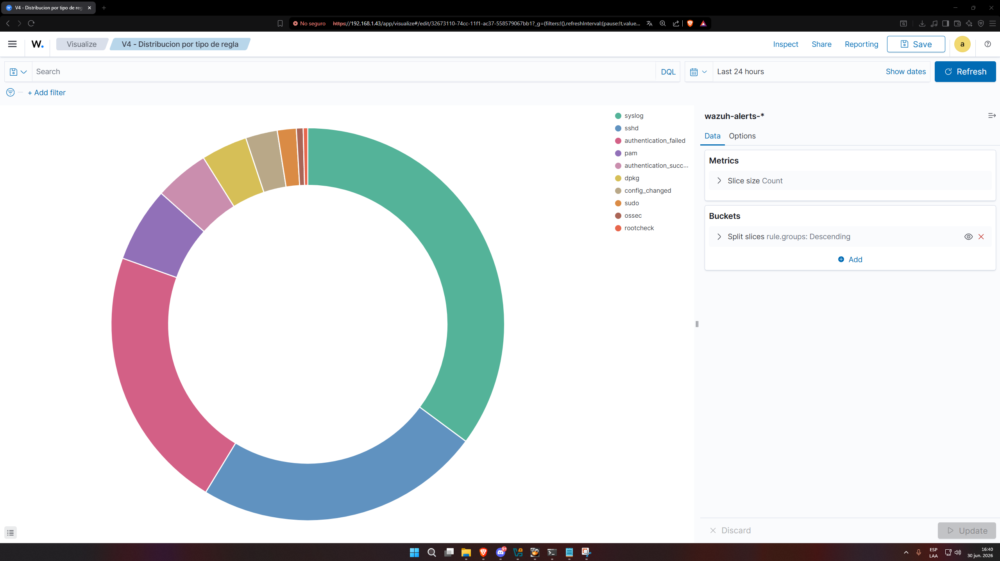

### Tarea 4.3 — Dashboard integrado

Dashboard creado: **"SOC - Monitor de Seguridad"**

- Integra las 4 visualizaciones
- Filtro de tiempo global: ultimas 24 horas
- Panel de texto con datos del autor
- Exportado como `lab4/dashboard_soc.json`

**Evidencia — Dashboard completo:**

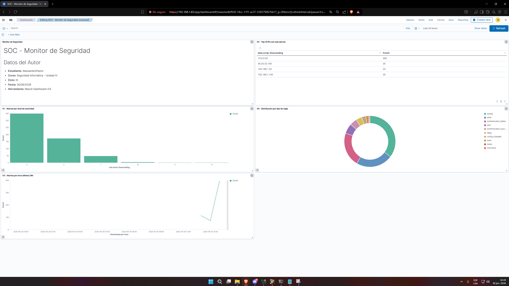

### Tarea 4.4 — Alerta de umbral

Monitor configurado en OpenSearch Alerting:

```json
{
  "name": "SOC-Alerta-Nivel10",
  "type": "query_level_monitor",
  "enabled": true,
  "schedule": { "period": { "unit": "MINUTES", "interval": 1 } },
  "trigger": {
    "name": "ABOVE 5",
    "condition": "ctx.results[0].hits.total.value > 5",
    "severity": "1 (Highest)"
  }
}
```

- Se activa cuando hay mas de 5 alertas en 5 minutos
- Estado: **Enabled**
- Ejecuta cada 1 minuto

**Evidencia — Alerta configurada:**

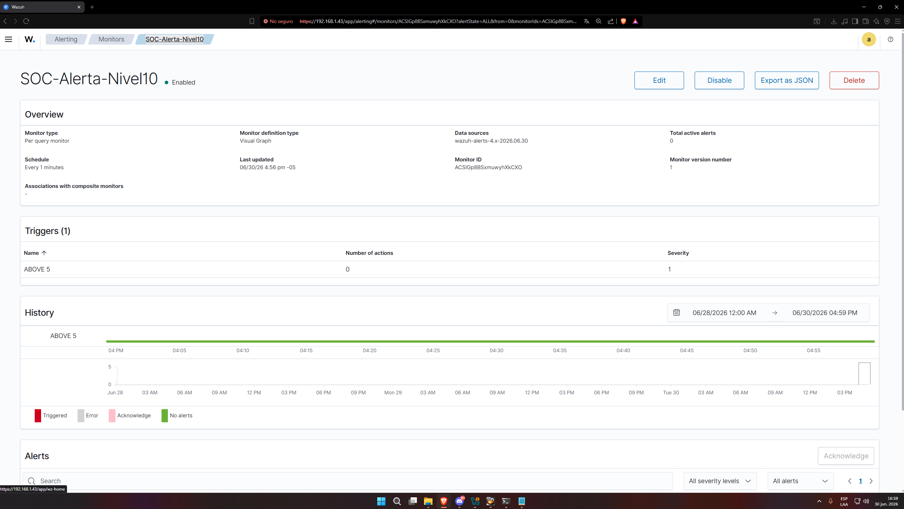

---

## Resumen de resultados

| Laboratorio | Descripcion | Puntos | Estado |
|---|---|---|---|
| Lab 1 | Análisis Forense de Logs con Python | 5 pts | Completado |
| Lab 2 | Reglas de Correlación en Wazuh | 4 pts | Completado |
| Lab 3 | Modelo ML de Detección de Anomalías | 6 pts | Completado |
| Lab 4 | Dashboard de Monitoreo SOC | 5 pts | Completado |
| **Total** | | **20 pts** | **Completado** |

---

<div align="center">

```
Universidad Peruana Unión — UPEU
Facultad de Ingeniería y Arquitectura
Escuela Profesional de Ingeniería de Sistemas
AlessandroPastor — Ciclo IX — 2026
```

</div>
